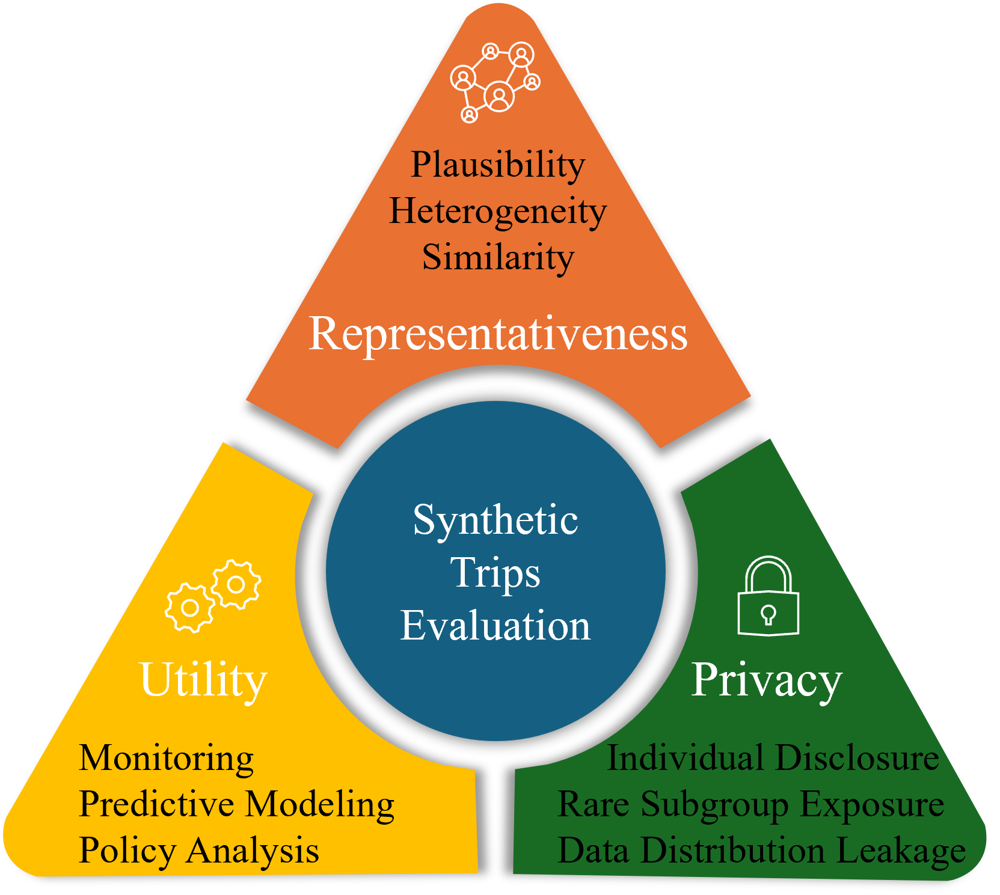
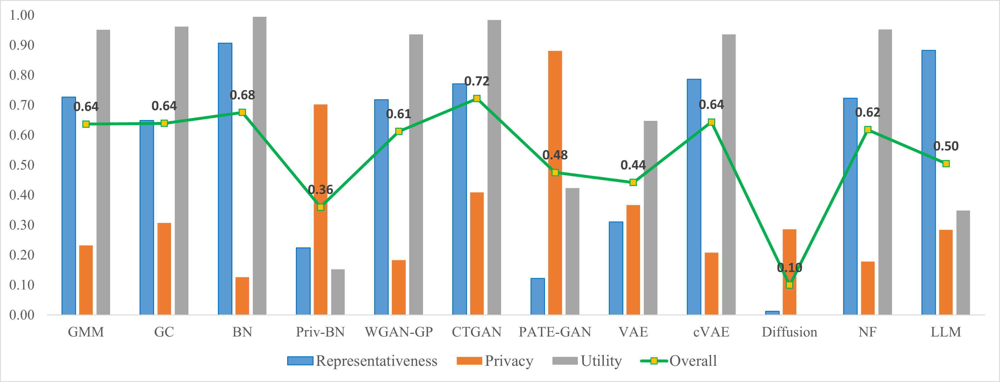

# Synthetic Data Evaluation Framework for Public Transport

This repository contains the implementation of a comprehensive evaluation framework for synthetic trip data, designed to balance **representativeness**, **privacy**, and **utility** in public transit research.

## 📌 Overview
The framework evaluates synthetic data across three dimensions:
- **Representativeness (R):** statistical similarity to real data at record, group, and population levels.  
- **Privacy (P):** protection against privacy risks, assessed via Membership Inference Attacks (MIA) and k-NN distance analysis.  
- **Utility (U):** ability of synthetic data to support downstream tasks such as monitoring, predictive modeling, and policy analysis.
  
<p align="center">
  
</p>

## 🚉 Methods
We benchmark a range of synthetic data generators:
- **Statistical models:** Bayesian Networks (BN), Gaussian Mixture Models (GMM), copulas.  
- **Deep Generative Models:** GANs, VAEs, Diffusion Models, Normalizing Flows, LLM.  
- **Privacy-enhanced models:** PrivBayes, PATE-GAN.  

## 📂 Project Structure
```markdown
├── evaluation/ # Evaluation scripts
│ ├── EVA_Privacy_MIA.py # Privacy evaluation via Membership Inference Attacks
│ ├── EVA_Privacy_NN.py # Privacy evaluation via k-NN analysis
│ ├── EVA_Representativeness.py # Representativeness evaluation
│ ├── EVA_Utility_Clustering.py # Utility evaluation (clustering tasks)
│ └── EVA_Utility_Prediction.py # Utility evaluation (prediction tasks)
│
├── generators/ # Synthetic data generators
│ ├── Syn_C_BN.py # Bayesian Network generator
│ ├── Syn_C_GMM.py # Gaussian Mixture Model generator
│ ├── Syn_C_Copulas.py # Copula-based generator
│ ├── Syn_C_privBayes.py # PrivBayes (DP Bayesian Network)
│ ├── Syn_D_VAE.py # Variational Autoencoder generator
│ ├── Syn_D_cVAE.py # Conditional VAE generator
│ ├── Syn_D_GAN_Vanilla.py # Vanilla GAN
│ ├── Syn_D_GAN_WGP.py # WGAN-GP
│ ├── Syn_D_GAN_DP.py # Differentially Private GAN
│ ├── Syn_D_GAN_PATE.py # PATE-GAN
│ ├── Syn_D_GAN_c_wgan.py # Conditional WGAN
│ ├── Syn_D_ctGAN.py # Conditional Tabular GAN
│ ├── Syn_D_Diffusion.py # Diffusion model generator
│ └── Syn_D_NF.py # Normalizing Flow generator
│
├── utils.py # Shared utility functions
└── README.md # Project documentation
```

## ⚙️ Requirements
- Python 3.9+
- PyTorch / TensorFlow (depending on model)
- NumPy, Pandas, Scikit-learn
- Matplotlib / Seaborn (for visualization)

Install dependencies:
```bash
pip install -r requirements.txt
```

## 🚀 Usage

- Generate synthetic data with the chosen model:
```bash 
python Syn_D_VAE.py
```
- Evaluate synthetic data quality:
```bash
python EVA_Representativeness.py
python EVA_Privacy_MIA.py
python EVA_Utility_Prediction.py
```
## 📖 Citation
```csharp
http:darinywu.com
```
## 🧭 Evaluation Results Overview
<p align="center">
  
</p>
